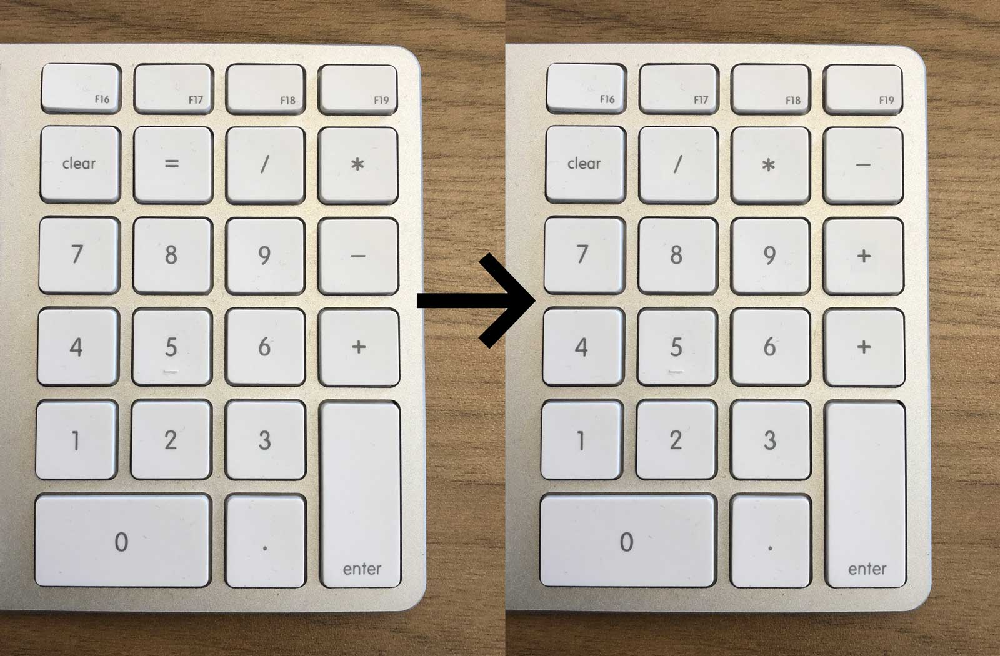

# mac-keypad-remap
Remap your Mac-style numeric keypad to function as a PC-style layout

## What it does
PC numeric keypads usually have a large plus key, followed by minus in the corner, then the asterisk and the slash.

Mac numeric keypads usually have a small plus key, followed by minus, and then the asterisk in the corner.

Out of all the keyboard changes that one has to adjust to when using both Windows and MacOS devices, this difference is the most uncomfortable for me. (Usually when typing dates.)

## How the numeric keypad mapping changes

## Usage
- Run `keypad_remap.sh` to remap your Mac numeric keypad to behave more like a PC one.
- Run `keypad_unmap.sh` to undo the remapping.

Note: Remapping does not persist between reboots. 

## Reference

The script makes use of the MacOS utility `hidutil` to remap the keys, which is documented here:

https://apple.stackexchange.com/questions/283252/how-do-i-remap-a-key-in-macos-sierra-e-g-right-alt-to-right-control

https://developer.apple.com/library/archive/technotes/tn2450/_index.html
